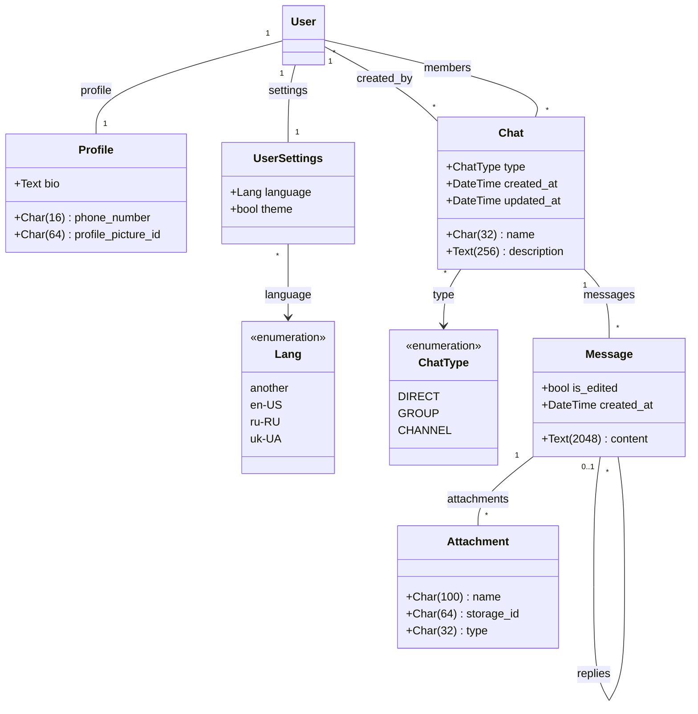

# Kapitan Chat
is chat for real ♂ pirates ♂ <br>
[Ukrainan language](/README.ua.md)
<br>
[Russian language](/README.ru.md)

## Table of Contents

- [About the project](#about-the-project)
- [Main features](#main-features)
- [Architecture](#architecture)
- [Tech stack](#tech-stack)
- [Models](#models)
- [Getting started](#getting-started)
  - [Prerequisites](#prerequisites)
  - [Backend installation](#backend-installation)
  - [Frontend installation](#frontend-installation)
  - [Environment variables](#environment-variables)

- [Contacts](#contacts)

## About the project

`Kapitan Chat` is a pet chat project built as a learning and experimental playground for:
- practicing full-stack patterns (React + Django REST);
- working with WebSockets and real-time message updates;
- implementing user settings (theme, language, locale);
- practicing Git workflow (branches, PRs, merges, conflicts).


## Main features

- **Registration and authentication**
  - JWT-based authentication;
  - storing tokens on the client and automatically attaching them to requests.

- **Chat list and conversations**
  - list of dialogs;
  - viewing message history;
  - selected chat indicators.

- **`Double-chat` mode**
  - open two chats at the same time;
  - resizable panels (resizable layout);
  - convenient work with multiple dialogs.

- **User settings**
  - choose interface language (JSON-based locales);
  - switch theme (light / dark);
  - store settings on the backend.

- **Message handling**
  - send text messages;
  - edit and delete messages;
  - support for attachments (files).

- **Real-time interface**
  - message updates without page reload;
  - WebSocket connection for chats.

## Architecture

The repository is organized as a monorepo:

```text
KapitanChat/
  kapitan_chat_backend/   # Django + DRF backend
  kapitan_chat_frontend/  # React frontend
  README.md
  LICENSE
  package-lock.json
```
>[!NOTE]
>TECH STACK
## Tech stack
- Backend
  - Python 3.x
  - Django
  - Django REST Framework
  - djangorestframework-simplejwt (JWT authentication)
  - django-cors-headers

- Frontend
  - React
  - Vite (dev server and bundler)
  - react-router-dom
  - axios
  - [emoji-mart](https://github.com/missive/emoji-mart?tab=readme-ov-file)
  - [resizable-panel](https://react-resizable-panels.vercel.app/)

- Other
  - WebSocket / Django Channels (real-time chat)
  - GitHub as the main code hosting
## Models

>[!WARNING]
>GETTING STARTED

## Getting started
### Prerequisites
- Git
- Python ≥ 3.12
- Node.js ≥ 20
- npm

### Backend installation
```sh
cd kapitan_chat_backend

# virtual environment
python -m venv venv
# Windows:
venv\Scripts\activate
# Linux/macOS:
source venv/bin/activate

# dependencies
pip install -r requirements.txt

# create migrations
py manage.py makemigrations

# apply migrations
python manage.py migrate

# run backend
uvicorn kapitan_chat_backend.asgi:application --reload

```
### Frontend installation
```sh
cd ../kapitan_chat_frontend

# install npm dependencies
npm install

# run dev server
npm run dev

```
## Environment variables

...To be added soon
env

Apache 2.0 License
